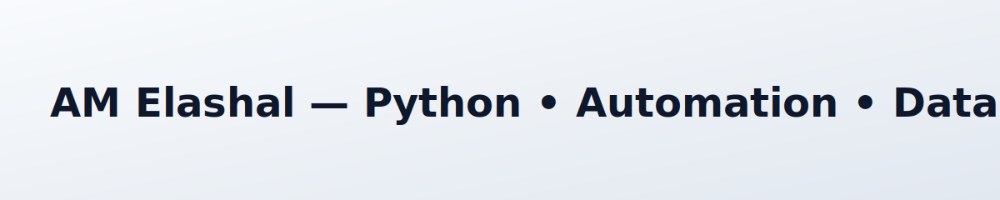

<picture>
  <source media="(prefers-color-scheme: dark)" srcset="assets/banner-dark.svg">
  
</picture>

## Hi, I’m AM Elashal

- Building with Python across automation, data analysis, and data science. Recently exploring context engineering for LLMs and reliable workflows.
- I enjoy turning messy processes into clear, automated systems with measurable impact.
- Open to collaborating on developer tooling, data platforms, and ML workflow automation.

**Links**: [GitHub](https://github.com/AMElashal26)

### Skills
- Languages: Python, SQL, JavaScript/TypeScript (basics)
- Data & ML: Pandas, NumPy, scikit-learn, Jupyter, matplotlib/Altair, notebooks-to-pipelines
- Automation & Workflows: GitHub Actions, Bash, Make, cron, REST APIs
- Cloud & Infra: Docker, Linux, basic AWS
- LLM/Context Engineering: prompt+retrieval patterns, evaluation harnesses, dataset curation

### Highlights
- Automation-first mindset: scripts, reproducible notebooks, and CI for data tasks
- Data pipelines that are observable, testable, and versioned
- Practical ML focused on clear metrics and reliable deployment paths

### Featured projects
Curated selection coming soon. In the meantime, here are the most recently updated public projects:

<!-- PROJECTS:START -->
- [AMElashal26](https://github.com/AMElashal26/AMElashal26): Python
- [context-engineering](https://github.com/AMElashal26/context-engineering): Views into practical applications of context-engineering
- [Javascript-Slot-Machine](https://github.com/AMElashal26/Javascript-Slot-Machine): JavaScript
- [Portfolio](https://github.com/AMElashal26/Portfolio)
- [Safari_Tabs_Archiver](https://github.com/AMElashal26/Safari_Tabs_Archiver): Exports and cleans tabs and tab groups in safari to hopefully let it run smoother · ⭐ 1
- [what-should-i-do](https://github.com/AMElashal26/what-should-i-do): TypeScript
<!-- PROJECTS:END -->

### Recent activity
Public events from my GitHub timeline:

<!-- ACTIVITY:START -->
- 2025-07-11: pushed 1 commit(s) to AMElashal26/Javascript-Slot-Machine
- 2025-07-11: pushed 1 commit(s) to AMElashal26/Javascript-Slot-Machine
- 2025-07-11: pushed 1 commit(s) to AMElashal26/Javascript-Slot-Machine
- 2025-07-11: pushed 1 commit(s) to AMElashal26/Javascript-Slot-Machine
- 2025-07-11: created branch main in AMElashal26/Javascript-Slot-Machine
<!-- ACTIVITY:END -->

### Language mix (approximate)
Top languages across my recent repositories:

<!-- LANGUAGES:START -->
- Jupyter Notebook: 84.9%
- JavaScript: 6.0%
- Python: 3.7%
- TypeScript: 3.1%
- CSS: 1.4%
- HTML: 0.9%
<!-- LANGUAGES:END -->

### Now / Focus
- Python automation for data workflows
- Context engineering patterns for LLM apps (chunking, retrieval, evaluation)
- Clean, testable data analysis with notebooks, scripts, and CI

### Contact / Collaborate
- Open to collaboration and interesting problems. Reach out via GitHub issues or discussions.

—

Last updated: <!-- UPDATED:START -->
2025-08-08
<!-- UPDATED:END -->
