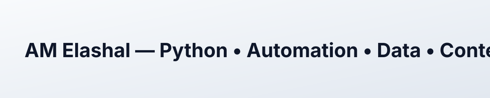

<picture>
  <source media="(prefers-color-scheme: dark)" srcset="assets/banner-dark.svg">
  
</picture>

## Hi, I’m AM Elashal

I build automation-first systems across Python, data workflows, and practical LLM reliability.

### Why this profile exists
- Help collaborators quickly find the most strategic repos.
- Show shipped work, not just tools.
- Make it easy to connect on relevant opportunities.

### Current focus
- Reliable context engineering patterns for LLM apps.
- Python automation for data-intensive workflows.
- Clean, testable analytics from notebook to production.

### Featured projects (curated + automated)
Priority projects are manually curated and then auto-filled with recent repos for freshness.

<!-- PROJECTS:START -->
- [context-engineering](https://github.com/AMElashal26/context-engineering): Practical patterns for reliable context engineering and evaluation. · domain: LLM workflows · maturity: active · impact: high
- [Safari_Tabs_Archiver](https://github.com/AMElashal26/Safari_Tabs_Archiver): Utility-first project that solves a concrete workflow pain point. · domain: automation · maturity: shipped · impact: medium · ⭐ 2
- [what-should-i-do](https://github.com/AMElashal26/what-should-i-do): Small product experiment with TypeScript and rapid iteration. · domain: product experiment · maturity: prototype · impact: medium
- [Javascript-Slot-Machine](https://github.com/AMElashal26/Javascript-Slot-Machine): Hands-on JavaScript project focused on interaction and logic. · domain: frontend · maturity: learning · impact: medium
- [Portfolio](https://github.com/AMElashal26/Portfolio): Portfolio project showcasing selected work and presentation direction. · domain: portfolio · maturity: active · impact: medium
- [learning-github-actions](https://github.com/AMElashal26/learning-github-actions)
<!-- PROJECTS:END -->

### Recently updated repositories

<!-- RECENT_REPOS:START -->
- 2026-06-23: [learning-github-actions](https://github.com/AMElashal26/learning-github-actions) (n/a)
- 2026-05-22: [reddit_scraper-context](https://github.com/AMElashal26/reddit_scraper-context) (n/a)
- 2026-05-17: [interactive](https://github.com/AMElashal26/interactive) (Shell)
- 2026-04-26: [Screenshots-Cleaner-PythApplescript](https://github.com/AMElashal26/Screenshots-Cleaner-PythApplescript) (Python)
- 2026-04-25: [screenshot-intel](https://github.com/AMElashal26/screenshot-intel) (Python)
<!-- RECENT_REPOS:END -->

### Recent public activity

<!-- ACTIVITY:START -->
- 2026-09-20: merged PR #4 in AMElashal26/AMElashal26
- 2026-09-20: pushed 0 commit(s) to AMElashal26/AMElashal26
- 2026-09-20: closed PR #5 in AMElashal26/AMElashal26
- 2026-09-20: IssueCommentEvent in AMElashal26/AMElashal26
- 2026-09-20: pushed 0 commit(s) to AMElashal26/AMElashal26
<!-- ACTIVITY:END -->

### Language mix (approximate)

<!-- LANGUAGES:START -->
- Python: 44.6%
- Shell: 24.4%
- Jupyter Notebook: 17.1%
- TypeScript: 11.6%
- HTML: 0.8%
- Dockerfile: 0.7%
<!-- LANGUAGES:END -->

### Work with me
- **Collaboration**: automation, developer workflows, data tooling, and ML/LLM reliability.
- **Where to reach out**: open an issue/discussion in relevant repos.

### Landing-page strategy docs
- [Goals and rubric](/docs/landing-page/goals-and-rubric.md)
- [Baseline analysis](/docs/landing-page/baseline.md)
- [Feature taxonomy matrix](/docs/landing-page/taxonomy-matrix.md)
- [Inspiration references](/docs/landing-page/inspiration.md)
- [Iteration log](/docs/landing-page/iteration-log.md)
- [Template A](/docs/landing-page/templates/template-a.md)
- [Template B](/docs/landing-page/templates/template-b.md)
- [Template C](/docs/landing-page/templates/template-c.md)
- [Template D](/docs/landing-page/templates/template-d.md)

Last updated: <!-- UPDATED:START -->
2026-09-22
<!-- UPDATED:END -->
